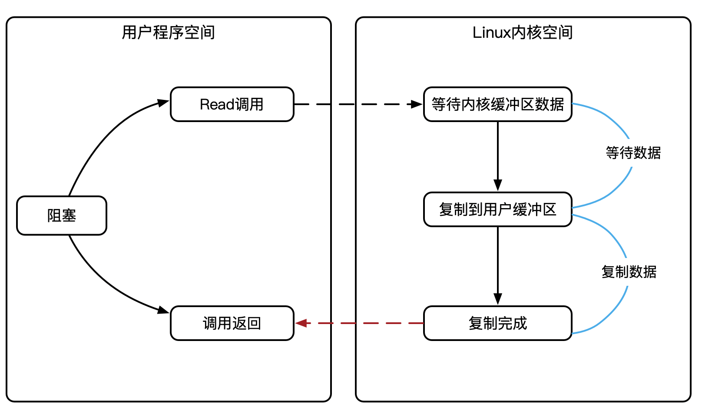
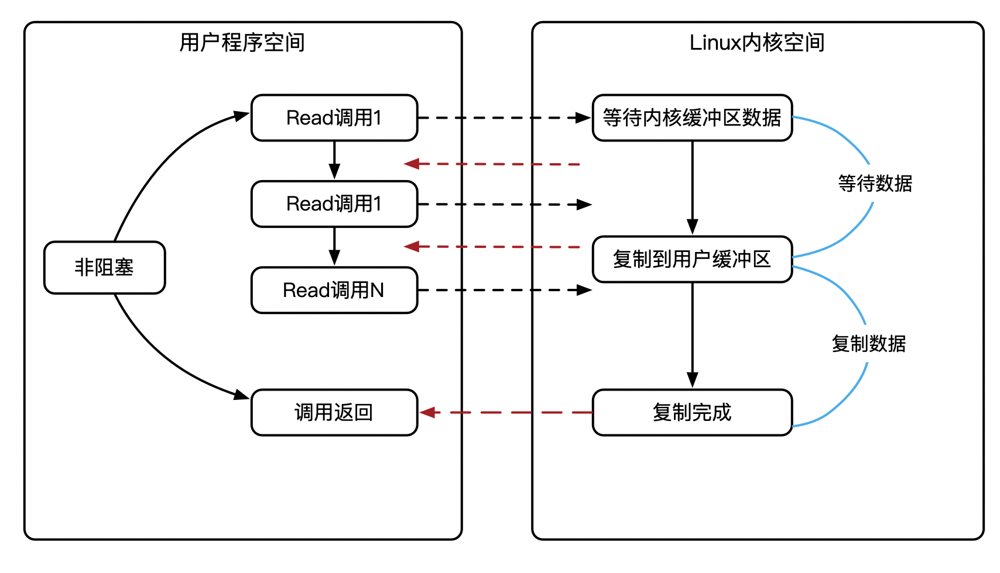
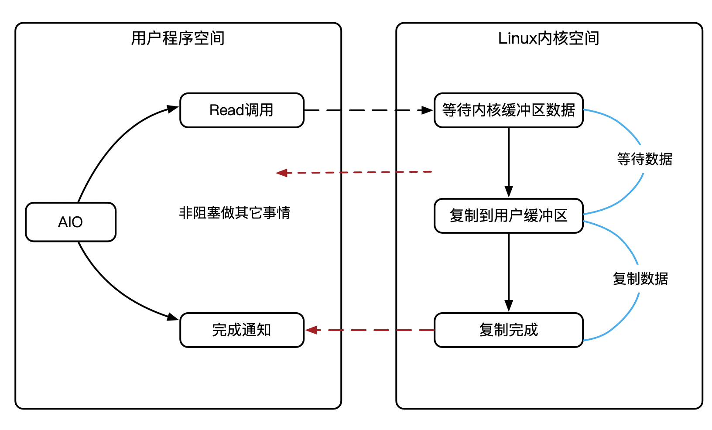

### 简述 BIO, NIO, AIO 的区别

服务器端编程，经常需要构造高性能的网络应用，需要选用高性能的IO模型，这也是通关大公司面试必备的知识。IO的模型，一般都是关于阻塞、非阻塞，同步、异步的划分。

#### 同步阻塞IO(BIO)

阻塞IO，指的是需要内核IO操作彻底完成后，才返回到用户空间执行用户的操作。

阻塞指的是用户空间程序的执行状态，传统的IO模型都是同步阻塞IO。在Java中，默认创建的 socket都是阻塞的。

**同步与异步**

- 同步IO，是一种用户空间与内核空间的IO发起方式。同步IO是指用户空间的线程是主动发起IO请求的一方，内核空间是被动接受方。
- 异步IO则反过来，是指系统内核是主动发起IO请求的一方，用户空间的线程是被动接受方。

在Java应用程序进程中，默认情况下， socket连接的IO操作都是同步阻塞IO( BIO），在阻塞式IO模型中，Java应用程序从IO系统调用开始，直到系统调用返回，在这段时间内，Java进程是阻塞的。返回成功后，应用进程开始处理用户空间的缓存区数据。

BIO的具体流程

在Java中发起一个 socket的read读操作的系统调用，流程大致如下:

- 从Java启动IO读的read系统调用开始，用户线程就进入阻塞状态

- 当系统内核收到read系统调用，就开始准备数据。一开始，数据可能还没有到达内核缓冲区(例如，还没有收到一个完整的 socket数据包)，这个时候内核就要等待。

- 内核一直等到完整的数据到达，就会将数据从内核缓冲区复制到用户缓冲区(用户空间的内存)，然后内核返回结果(例如返回复制到用户缓冲区中的字节数)。

- 直到内核返回后，用户线程才会解除阻塞的状态，重新运行起来。

  

阻塞IO的特点是，在内核进行IO执行的两个阶段，用户线程都被阻塞了。

阻塞IO的优点是，应用的程序开发非常简单;在阻塞等待数据期间，用户线程挂起。在阻塞期间，用户线程基本不会占用CPU资源。

阻塞IO的缺点是，一般情况下，会为每个连接配备一个独立的线程反过来说，就是一个线程维护一个连接的IO操作。在并发量小的情况下，这样做没有什么问题。但是，当在高并发的应用场景下，需要大量的线程来维护大量的网络连接，内存、线程切换开销会非常巨大。因此，基本上阻塞IO模型在高并发应用场景下是不可用的。

#### 同步非阻塞(NIO)

非阻塞IO，指的是用户空间的程序不需要等待内核IO操作彻底完成，可以立即返回用户空间执行用户的操作，即处于非阻塞的状态，与此同时内核会立即返回给用户一个状态值。

简单来说，阻塞是指用户空间(调用线程)一直在等待，而不能干别的事情;  非阻塞是指用户空间(调用线程)拿到内核返回的状态值就返回自己的空间，IO操作可以干就干，不可以干，就去干别的事情。

这里所说的NIO(同步非阻塞IO)模型，并非Java的NIO( New IO)库。

socket连接默认是阻塞模式，**非阻塞IO要求 socket被设置为 NONBLOCK**。使用非阻塞模式的IO读写，叫作同步非阻塞IO( None Blocking IO)，简称为NIO模式。在NO模型中，应用程序一旦开始IO系统调用，会出现以下两种情况:

- 在内核缓冲区中没有数据的情况下，系统调用会立即返回，返回个调用失败的信息。

- 在内核缓冲区中有数据的情况下，是阻塞的，直到数据从内核缓冲复制到用户进程缓冲。复制完成后，系统调用返回成功，应用进程开始处理用户空间的缓存数据。同步非阻塞IO的流程

发起一个非阻塞 socket的read读操作的系统调用，流程如下

- 在内核数据没有准备好的阶段，用户线程发起IO请求时，立即返回。所以，为了读取到最终的数据，用户线程需要不断地发起IO系统调用
- 内核数据到达后，用户线程发起系统调用，用户线程阻塞。内核开始复制数据，它会将数据从内核缓冲区复制到用户缓冲区(用户空间的内存)，然后内核返回结果(例如返回复制到的用户缓冲区的字节数)。
- 用户线程读到数据后，才会解除阻塞状态，重新运行起来。也就是说，用户进程需要经过多次的尝试，才能保证最终真正读到数据，而后继续执行。

**同步非阻塞IO的特点**，应用程序的线程需要不断地进行IO系统调用，轮询数据是否已经准备好，如果没有准备好，就继续轮询，直到完成IO系统调用为止。

**同步非阻塞IO的优点**，每次发起的IO系统调用，在内核等待数据过程中可以立即返回。用户线程不会阻塞，实时性较好。

**同步非阻塞IO的缺点**，不断地轮询内核，这将占用大量的CPU时间，效率低下。

总体来说，在高并发应用场景下，同步非阻塞IO也是不可用的。一般Web服务器不使用这种IO模型。这种IO模型一般很少直接使用，而是在其他IO模型中使用非阻塞IO这一特性。在Java的实际开发中，也不会涉及这种IO模型。

这里说明一下，同步非阻塞IO，可以简称为NIO，但是，它不是Java中的NIO，虽然它们的英文缩写一样，希望大家不要混淆。Java的NIO( New Io)，对应的不是四种基础O模型中的NIO( None blockingⅠO)模型，而是另外的一种模型，叫作IO多路复用模型(ⅠOMultiplexing)。

#### 异步IO(AIO)

异步IO，指的是用户空间与内核空间的调用方式反过来。用户空间的线程变成被动接受者，而内核空间成了主动调用者。这有点类似于Java中比较典型的回调模式，用户空间的线程向内核空间注册了各种IO事件的回调函数，由内核去主动调用。

异步IO模型( Asynchronous I0，简称为AIO)。

AIO的基本流程是: 用户线程通过系统调用，向内核注册某个IO操作。内核在整个IO操作(包括数据准备、数据复制)完成后，通知用户程序，用户执行后续的业务操作。

异步IO模型中，在整个内核的数据处理过程中，包括内核将数据从网络物理设备(网卡)读取到内核缓冲区、将内核缓冲区的数据复制到用户缓冲区，用户程序都不需要阻塞。

异步IO模型的流程，

发起一个异步IO的read读操作的系统调用，流程如下

- 当用户线程发起了read系统调用，立刻就可以开始去做其他的事，用户线程不阻塞。
- 内核就开始了IO的第一个阶段:准备数据。等到数据准备好了，内核就会将数据从内核缓冲区复制到用户缓冲区(用户空间的内存)
- 内核会给用户线程发送一个信号( Signal)，或者回调用户线程注册的回调接口，告诉用户线程read操作完成了。
- 用户线程读取用户缓冲区的数据，完成后续的业务操作

异步IO模型的特点：在内核等待数据和复制数据的两个阶段，用户线程都不是阻塞的。用户线程需要接收内核的IO操作完成的事件，或者用户线程需要注册一个IO操作完成的回调函数。正因为如此，异步IO有的时候也被称为信号驱动IO。

异步IO异步模型的缺点：应用程序仅需要进行事件的注册与接收，其余的工作都留给了操作系统，也就是说，需要底层内核提供支持。

理论上来说，异步IO是真正的异步输入输出，它的吞吐量高于IO多路复用模型的吞吐量。

就目前而言， Windows系统下通过IOCP实现了真正的异步IO。而在inuⅸx系统下，异步IO模型在2.6版本才引入，目前并不完善，其底层实现仍使用epol，与IO多路复用相同，因此在性能上没有明显的优势。

大多数的高并发服务器端的程序，一般都是基于 Linux系统的。因而，目前这类高并发网络应用程序的开发，大多采用IO多路复用模型。大名鼎鼎的Nety框架，使用的就是IO多路复用模型，而不是异步IO模型

